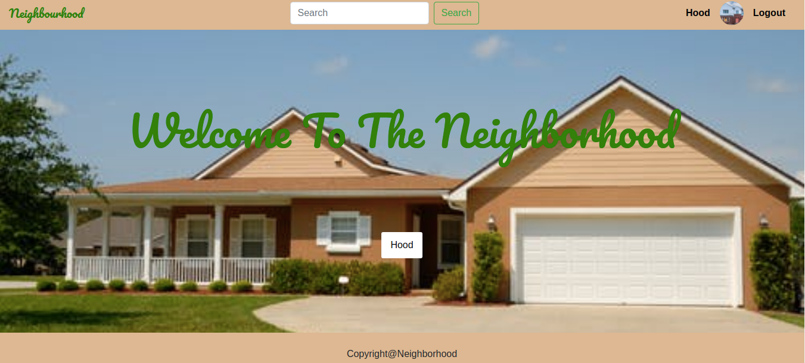

# The-Neighbourhood.
Tis is a neighborhood app where a user must signup first, be able to join a hood owned by the hood admin, and once you join a hood, one can see businesses and posts in only that wood they belong to


##  Live Link
 ("")
## Screenshots
###### Screenshot 1




## User Story
* View different projects from the Application
* Click a single project to expand it and view the details of that post
* Search for projects by different names.
* Rate a project according to usability, content and design.
* Update profile.
## Setup and Installation
##### Clone the repository:
 ```bash
```
##### Navigate into the folder and install requirements
 ```bash
cd neighbourhood pip install -r requirements.txt
```
##### Install and activate Virtual
 ```bash
- python3 -m venv virtual - source virtual/bin/activate
```
##### Install Dependencies
 ```bash
 pip install -r requirements.txt
```
##### Setup Database
  SetUp your database User,Password, Host then make migrate
 ```bash
python manage.py makemigrations hood
 ```
 Now Migrate
 ```bash
 python manage.py migrate
```
##### Run the application
 ```bash
 python manage.py runserver
```
##### Testing the application
 ```bash
 python manage.py test
```
Open the application on your browser `127.0.0.1:8000`.
## Technology used
* [Python3.8](https://www.python.org/)
* [Django==3.2.7](https://docs.djangoproject.com/en/2.2/)
* [Heroku](https://heroku.com)

